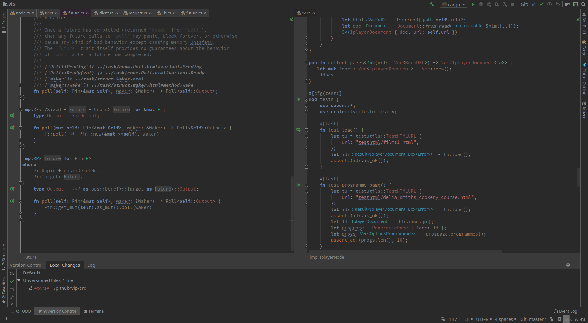
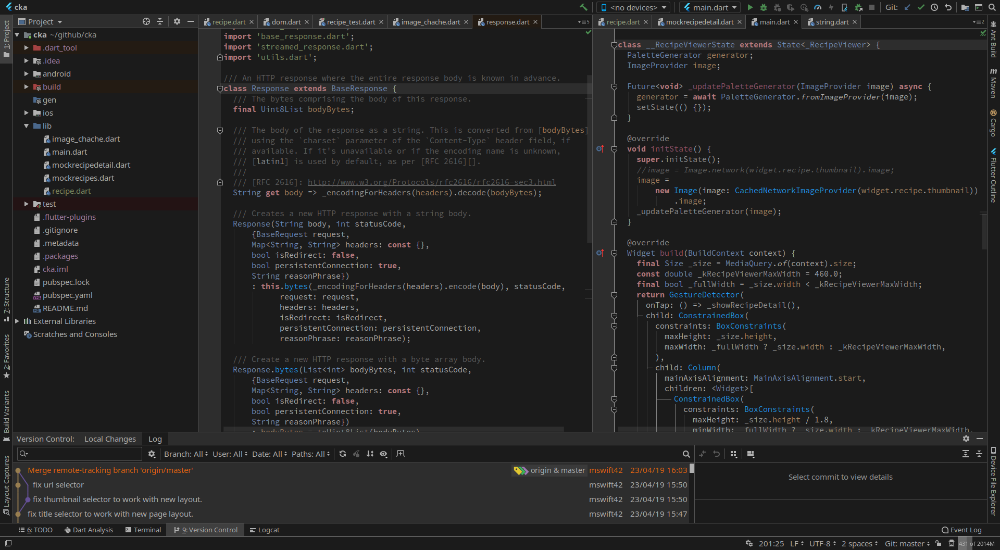
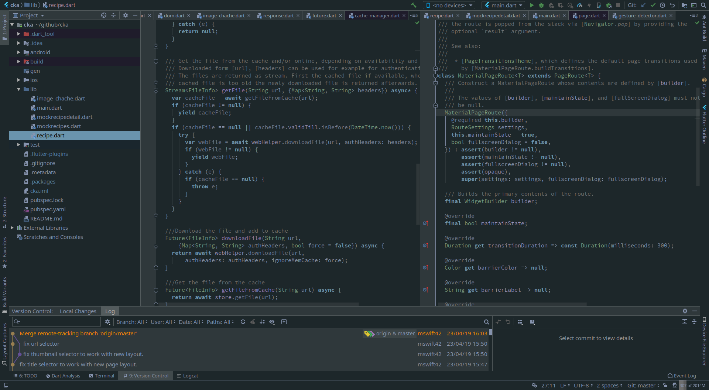
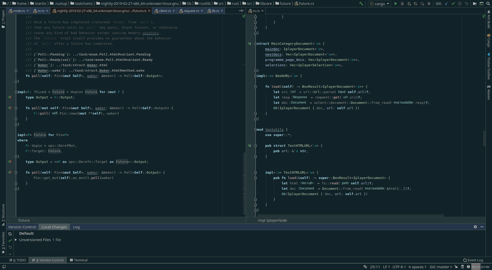
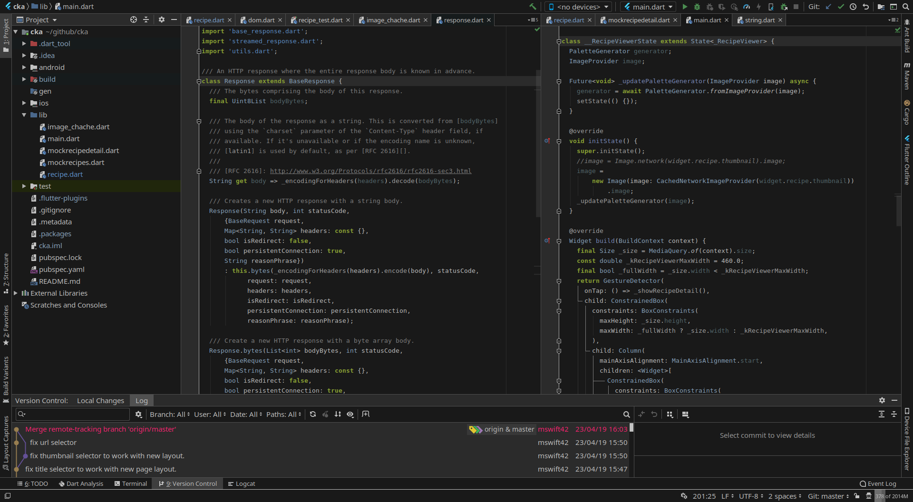
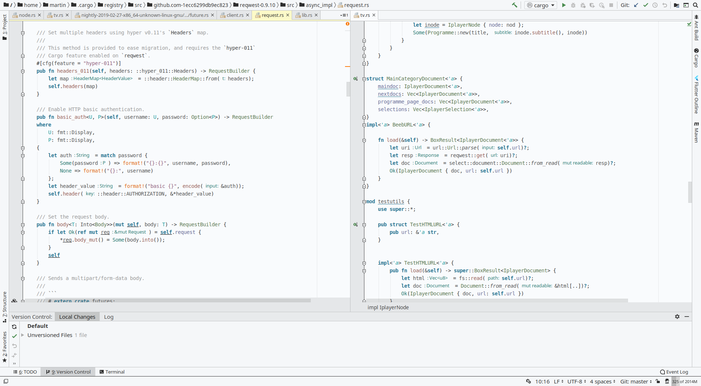
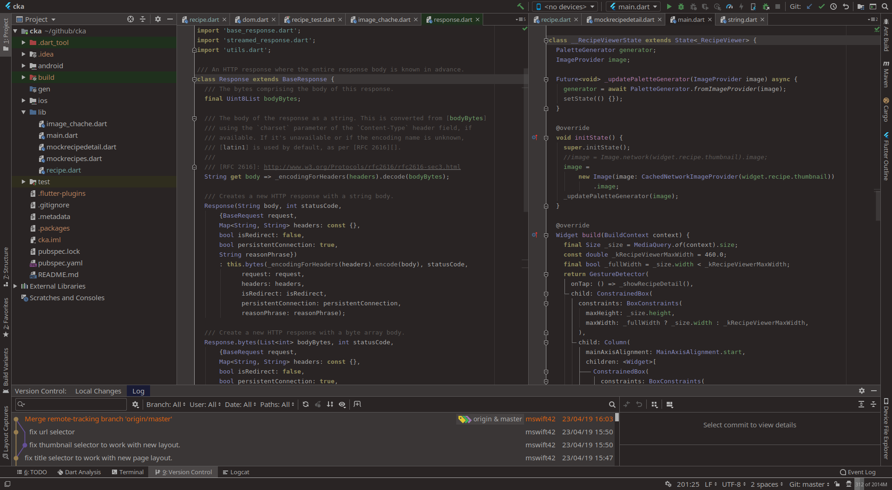
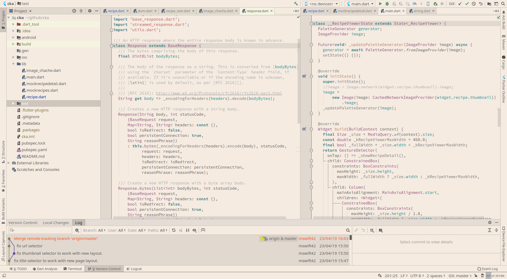

# IntelliJ Ui Themes for versions >= 191.

Custom UI theme plugins for IntelliJ IDEA, PhpStorm, PyCharm, RubyMine, WebStorm, DataGrip, GoLand, CLion, Rider, or AppCode.

## Installation

All plugins are available on the jetbrains plugin marketplace.

## License

MIT

## Screenshots

Foggy-night

Madrid

MetalHeart

Reykjavik

Silkworm

soft-charcoal

Thursday

Warm-Night

White-Sand

## Copyright

2019 Martin Haesler